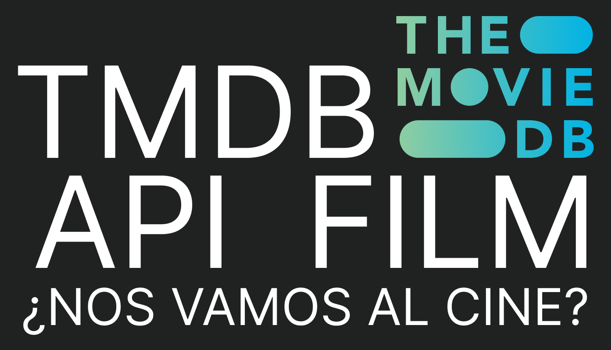

 

## Funcionamiento del programa
La idea es crear un programa que proporcione diferente tipo de información sobre películas. Para ello, se utilizará la API de [TMDB](https://www.themoviedb.org/documentation/api).

De momento, las opciones disponibles para consultar son:  
1. Buscar el código de una película según su nombre.
2. Buscar la siguiente información de una película proporcionando su código:
   - Título
   - Géneros
   - Argumento
   - Duración
   - Enlace a su web en IMDB
3. Películas recomendadas si te gusta una película concreta.
4. Obtener 5 películas "trending topic" semanal.
5. Obtener 5 películas "trending topic" diario.
6. Mostrar géneros disponibles. 

## Mejoras a futuro  
- Implementar más opciones en el menú, como por ejemplo:
  - Reviews
  - Videos
  - Series
  - Episodios de series
  - Actores/Actrices
  - Programación diaria de TV
  - ...
- Mejorar el código modularizando y mejorando la legibilidad.
- Controlar excepciones concretas.
- Seguir métodos SOLID.
- Añadir opción de filtrado por género en el trending semanal y diario.
- Hacer el programa no en una única clase.

 En definitiva, es un programa que puede escalar en número de opciones según las posibilidades de la API. Además, se pueden hacer versiones personalizadas para películas, series o TV.

 ## Fuentes

 ### Videos
- [Andy´s Tech Tutorials canal YT](https://www.youtube.com/watch?v=FlFyrOEz2S4&t=151s&ab_channel=Andy%27sTechTutorials)
- [Makes Sense canal YT](https://www.youtube.com/watch?v=vlenVDbJKsA&ab_channel=makessense)
- [How to make API calls to MovieDB](https://www.youtube.com/watch?v=WSvRFYPQyko&t=1057s&ab_channel=makessense)
- [How to set environment variables in Mac](https://www.youtube.com/watch?v=-cASjkF94dc&ab_channel=MacOSXTutorialsandAppreviewsfromHowTech)
- [Taller consumir API con Python - CodigoFacilito](https://www.youtube.com/watch?v=12NPmrdoKKs&t=4s&ab_channel=codigofacilito)

### API TMDB
 - [API TMDB](https://developer.themoviedb.org/reference/intro/getting-started)

### Webgrafía
 - [Apuntes Rafa del Castillo](https://github.com/rdelcastillo/DAW-Python/blob/master/notebooks/5.1%20Rest%20Api%20en%20Python.ipynb)
 - [Real Python](https://realpython.com/api-integration-in-python/)
 - [HTTP error](https://developer.mozilla.org/en-US/docs/Web/HTTP/Status#client_error_responses)
 - [Finding data TMDB](https://developer.themoviedb.org/docs/finding-data)
 - [Géneros e ID TMDB](https://www.themoviedb.org/talk/5daf6eb0ae36680011d7e6ee)
- [Cómo usar Postman](https://desarrolloweb.com/articulos/como-usar-postman-probar-api)
- [Docstring](https://pywombat.com/articles/docstring-python)